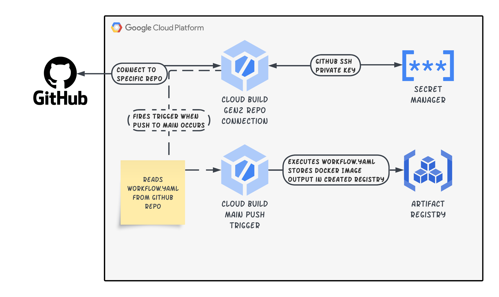

# Additional Functionality
This terraform-extras directory shows how to add Gen2 Cloud Build repositories and Docker Image building to Artifact Repositories to pass your own Images to the Cloud Run container that is created in the core `terraform/` folder.

## Architecture Diagram

  

## Additional Files
1. triggers.tf
This file shows how to create a cloud build trigger based on a github repository defined in the repository.tf as well as the workflow.yaml file to utilise

2. Cloud Build workflow.yaml
This file shows a very basic BUILD implementation for a docker container based on a Docker file at the given defined location in the workflow.yaml

3. repository.tf
This file shows how to establish a gen2 cloud build repository conenction to github for use in the cloud build triggers and the pieces required.

4. locals.tf
This file is just a reference for any of the 'variables' that would be required as part of this `terraform-extras`, these local references would need to be replaced with variables for a proper implementation.

